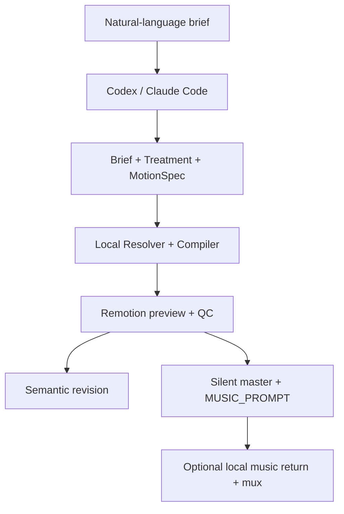

# Local Text-to-Motion Compiler — Design Specification

**Status:** Design direction confirmed with continuity policy A on 2026-07-21. The implementation plan is awaiting explicit user approval; implementation has not started.

**Product sentence:** A single local Remotion repository that Codex or Claude Code can turn from a natural-language brief into deterministic, continuity-first 2D motion graphics, a preview, a final MP4, an editable project, and a third-party music-generation prompt—without calling any model or media API from the repository.

---

## 1. Fixed Scope

### Supported

- One local user operating one Git repository through Codex or Claude Code.
- One-sentence prompts and optional structured briefs.
- Pure code 2D motion graphics rendered with React, SVG, Canvas, CSS and Remotion.
- Local user-supplied logos, screenshots, images, fonts and reference films.
- Kinetic typography, abstract geometry, diagrams, data motion, UI motion, logo motion, title sequences, explainers and product/social motion films.
- A deterministic `MotionSpec → ResolvedMotionIR → RenderPlan → Remotion` pipeline.
- Local Remotion Studio preview, low-resolution animatic, stills, QC and final render.
- Natural-language revisions translated by the coding agent into semantic patches.
- `MUSIC_PROMPT.md` for a user-selected third-party music generator.
- Local alignment and FFmpeg mux after the user manually returns a music file.

### Explicitly unsupported

- A Web app, custom Studio UI, SaaS, multi-user accounts, permissions or sharing.
- Worker processes, queues, SQLite, PostgreSQL, Redis, S3 or cloud rendering.
- OpenAI, Anthropic, Suno, Udio, ElevenLabs or other model/media SDKs.
- Repository-managed API keys, `.env` secrets, model gateways or HTTP model calls.
- Remotion API/license/public-license key configuration or licensing telemetry inside the repository; eligibility under the exact bundled Remotion license is an operator precondition, not a secret-handling feature.
- AI-generated images, AI-generated video, text-to-image or diffusion-video pipelines.
- Stock or generated footage as the film's visual substrate.
- TTS or automatic voice generation.
- True 3D, fluid simulation, character acting or hand-drawn frame-by-frame animation in V1.

The coding agent may use capabilities supplied by its host environment, but the repository itself remains an offline-capable deterministic motion tool. Host behavior is not reimplemented inside the repository.

---

## 2. User Experience

There is no product dashboard. The conversation with Codex or Claude Code is the interface, and Remotion Studio is the visual preview surface.



### Fast path

1. The user asks Codex or Claude Code for a motion video in ordinary language.
2. The agent asks only for missing facts that would make the film false or unusable. Creative gaps use documented assumptions.
3. The agent writes the canonical local artifacts.
4. The deterministic toolchain validates, resolves, compiles and renders a low-resolution preview.
5. Technical QC runs, then the agent performs a cold visual review using local frames and the preview.
6. The agent repairs bounded issues and presents the preview.
7. After the Preview Gate, the toolchain renders the final silent MP4 and generates `MUSIC_PROMPT.md`.

### Structured path

The user may supply audience, destination, duration, format, facts, copy, CTA, brand tokens, assets, references and constraints. These fields enter the same pipeline; there is no separate “professional product mode.”

### Revision path

The user can say, for example, “Shorten the second beat by one second, change this headline, and leave everything else locked.” The agent writes a semantic patch, the local revision engine computes the impact set, and only affected specifications and derived artifacts are rebuilt.

---

## 3. Intelligence Boundary

The repository does not contain or invoke an AI model.

| Concern | Owner |
|---|---|
| Interpret natural language | Codex or Claude Code host |
| Make creative choices | Host agent following repository prompts |
| Preserve authoritative decisions | Versioned local JSON/Markdown artifacts |
| Validate schemas and references | Local deterministic code |
| Resolve frames, layout and bindings | Local deterministic code |
| Render every frame | Remotion runtime |
| Technical QC | Local TypeScript, FFmpeg and image tools |
| Visual cold review | Host agent following a reviewer prompt, using local files |
| Generate music | User-selected external tool, operated manually by the user |

Both agent entry points are thin:

- `AGENTS.md` is the Codex entry point.
- `CLAUDE.md` and `.claude/skills/video/SKILL.md` are the Claude Code entry points.
- All three link to the same canonical files under `agent/` and `craft/`; rules are not duplicated.

---

## 4. Canonical Artifacts and Authority

```text
BriefSpec
→ TreatmentSpec
→ MotionSpec
→ ResolvedMotionIR
→ RenderPlan
→ Preview / Final Render
```

| Artifact | Authority | Must not decide |
|---|---|---|
| `brief.spec.json` | Goal, audience, facts, message, CTA, format, supplied assets, constraints and assumptions | Visual composition or exact timing |
| `treatment.json` | Narrative strategy, visual thesis, motion profile, style pack, beat intentions and transition vocabulary | Pixel geometry or executable code |
| `motion.spec.json` | Beats, persistent nodes, motion tracks, camera intent, continuity bridges and capability intents | Runtime implementation details |
| `motion.resolved.json` | Exact frames, pixels, text layout, asset/font resolution and capability versions | New creative decisions |
| `render.plan.json` | Canonical frame-evaluable tracks, renderer/effect implementation hashes, engine build identity and output profiles | Replanning or silent fallbacks |
| `audio-brief.json` | Music style and cues bound to one locked RenderPlan hash | Music generation or remote service selection |
| `revision.patch.json` | Explicit change set, locks and expected source hashes | Unrelated redesign |
| `qc-report.json` | Evidence, diagnostics, severity and release decision | Silent creative edits |
| `creative-review.json` / `motion-review.json` | Cold-review findings bound to one RenderPlan hash | Approve a different plan or mutate source |
| `preview-approval.json` | Explicit user or configured-agent approval bound to the current revision and RenderPlan hash | Bypass QC or reviews |

Every derived artifact includes a schema version, revision ID, parent hashes, canonical SHA-256 and a strict producer object: `{kind: 'host' | 'tool', id: 'codex' | 'claude-code' | 'human' | 'resolver' | 'compiler' | 'renderer' | 'qc' | 'revision-engine' | 'audio-tool' | 'delivery-tool', version: string}`. Local Git history is the durable audit trail; no database or queue exists.

---

## 5. Continuity-First Motion Language

The chosen policy is **A: seamless by default, rare justified hard cuts**.

> A beat is a narrative state, not a slide. The image may hold, but the visual world must not reset like a PDF page. Each boundary must preserve a persistent object, a shared visual anchor, a traceable camera path or a motivated action/direction.

`TreatmentSpec.continuityPolicy` is fixed to `seamless-default`. Creative direction chooses only a `compositionMode`—`persistent-stage`, `continuous-world` or `held-shot`—so a style choice cannot disable the continuity policy.

### Default transition priority

1. Same-node shared-element transformation.
2. Camera navigation that reveals a real spatial relationship.
3. Morph into the real target state.
4. Match on action.
5. Directional push for forward/back/parallel meaning.
6. Justified chapter cut as an exception.

### Continuity laws

- One global frame clock drives the entire film.
- The world is mounted once for the full duration.
- A beat never causes an automatic full-frame component remount.
- A node that persists across beats keeps one `nodeId`, one React key and one DOM identity.
- All nodes share one declared coordinate system and transform-origin convention.
- The film owns one global camera track. Camera movement is expressed as holds and meaningful travels.
- Seamless does not mean constant motion. A held camera with live internal content is preferred to decorative drifting.
- A camera travel must be eye-trackable, reveal a real relationship and use one primary verb unless the combination is semantically necessary.
- Shared-element motion changes the same node's geometry track; it does not replace it with a visual copy.
- If a split runtime handoff is unavoidable, the real target is mounted early, frozen at its initial state and allowed to take over the bridge. A hand-built approximation of the target is forbidden.
- A transition cannot expose a dead, transparent, bare or accidental black frame.
- A bridge's terminal geometry must equal the next stable state within a one-pixel tolerance for declared exact handoffs.
- Text/content changes within a bridge use a declared crossfade, mask, shared-text morph or replace-on-action; they do not pop on one frame.
- Each beat has one primary focal node.
- A film uses no more than three ordinary transition families plus at most one signature transition.
- Narrative and emotional truth outrank a clever geometric seam. When there is no honest identity, causal or spatial relationship, use one justified chapter cut rather than a fake morph.
- Numeric timing ranges in craft documents are defaults tied to a motion profile, not universal hard laws.

### Hard-cut exception policy

A hard cut is represented only as `chapter-cut`. It requires:

- a real semantic, temporal, spatial or emotional break;
- an explicit exception justification;
- outgoing and incoming eye-trace anchors;
- a cut budget defined by the treatment;
- an absolute V1 ceiling of one chapter cut in the entire film, which the treatment cannot raise;
- zero transition frames, while all other bridge modes require positive duration;
- no adjacent chapter cuts.

The validator enforces the treatment budget and reports `SLIDE_LIKE_CUT_PATTERN` when boundaries repeatedly replace most opacity- and projected-area-weighted visible content, lack a salient persistent anchor, repeat the same full-page composition/timing, or use empty reasons such as “next scene.” A single justified cut may pass; slide-deck rhythm may not.

---

## 6. MotionSpec Model

Source `MotionSpec` describes stable information states and the motion between them. It does not describe independently mounted scenes.

```ts
type SegmentRef = {segmentId: string; progress: number};
type SegmentRange = {from: SegmentRef; to: SegmentRef};
type NormalizedPoint = {x: number; y: number}; // each component is 0..1

type MotionSpec = {
  schemaVersion: "motion-spec@1";
  projectId: string;
  treatmentHash: string;
  canvas: {
    width: number;
    height: number;
    fps: 24 | 25 | 30 | 50 | 60;
  };
  timeline: {
    beats: Beat[];
    bridges: ContinuityBridge[];
  };
  world: {
    coordinateSpace: "composition-pixels";
    origin: "top-left";
    transformOrigin: "top-left";
    childGeometry: "parent-local";
    nodes: PersistentNode[];
  };
  camera: CameraTrack;
  motionCues: MotionCue[];
};

type Beat = {
  id: string;
  durationFrames: number;
  objective: string;
  message: string;
  focalNodeId: string;
  liveContentNodeIds: string[];
  settleAt: SegmentRef;
  holdRange: SegmentRange;
};

type BridgeBase = {
  id: string;
  fromBeatId: string;
  toBeatId: string;
  durationFrames: number;
  narrativeReason: string;
  transitionFamily: string;
  vocabularyRole: "ordinary" | "signature";
  motionOwnership: "camera" | "node" | "camera-and-node-semantic";
  combinationMeaning?: string;
  eyeTrace: {
    outgoing: {nodeId: string; point: NormalizedPoint};
    incoming: {nodeId: string; point: NormalizedPoint};
  };
};

type SharedElementBridge = BridgeBase & {
  mode: "shared-element";
  nodeId: string;
  motionRange: SegmentRange;
};

type CameraNavigationBridge = BridgeBase & {
  mode: "camera-navigation";
  cameraSegmentId: string;
  destinationNodeId: string;
  spatialRelationship: string;
};

type MorphIntoTargetBridge = BridgeBase & {
  mode: "morph-into-target";
  sourceNodeId: string;
  targetNodeId: string;
  motionRange: SegmentRange;
  preRollFrames: number;
  settleFrames: number;
};

type MatchOnActionBridge = BridgeBase & {
  mode: "match-on-action";
  outgoingNodeId: string;
  incomingNodeId: string;
  actionAt: SegmentRef;
  action: "translate" | "scale" | "rotate" | "draw" | "expand" | "collapse";
};

type DirectionalPushBridge = BridgeBase & {
  mode: "directional-push";
  direction: "left" | "right" | "up" | "down";
  semanticDirection: "forward" | "back" | "parallel";
};

type ChapterCutBridge = BridgeBase & {
  mode: "chapter-cut";
  durationFrames: 0;
  reason: "new-chapter" | "time-jump" | "location-jump" |
    "emotional-impact";
  exceptionJustification: string;
  maxEyeTraceDistanceNormalized: number;
};

type ContinuityBridge =
  | SharedElementBridge
  | CameraNavigationBridge
  | MorphIntoTargetBridge
  | MatchOnActionBridge
  | DirectionalPushBridge
  | ChapterCutBridge;

type ContentTransition = {
  fromStateId: string;
  toStateId: string;
  range: SegmentRange;
  mode: "crossfade" | "masked-reveal" | "shared-text-morph" | "replace-on-action";
};

type PersistentNode = {
  id: string;
  kind: "text" | "shape" | "path" | "image" | "ui" | "chart" | "logo" | "group";
  parentId?: string;
  space: "world" | "screen";
  semanticRole: "content" | "decorative" | "background" | "overlay";
  renderer: {id: string; version: string; props: unknown};
  effects: Array<{
    id: string;
    version: string;
    range: SegmentRange;
    props: unknown;
  }>;
  geometryTrack: Track<GeometryState>;
  styleTrack: Track<StyleState>;
  contentTrack?: Track<ContentState>;
  contentTransitions?: ContentTransition[];
  visibleTrack: Track<number>;
};

type CameraTrack = {
  id: "main-camera";
  segments: Array<
    | {id: string; mode: "hold"; segmentId: string; state: CameraState}
    | {
        id: string;
        mode: "move";
        segmentId: string;
        from: CameraState;
        to: CameraState;
        verb: "pan" | "zoom" | "orbit";
        easing: string;
        reveals: string;
      }
  >;
};

type HandoffBase = {
  bridgeId: string;
  sourceFrame: number;
  targetFrame: number;
};

type HandoffCheck =
  | (HandoffBase & {
      mode: "exact-visual";
      anchorNodeId: string;
      cropOrMask: ResolvedRegion;
      minPsnrDb: number;
      maxGeometryDriftPx: number;
    })
  | (HandoffBase & {
      mode: "geometry-only";
      anchorNodeId: string;
      maxGeometryDriftPx: number;
    })
  | (HandoffBase & {
      mode: "continuous-motion";
      anchorNodeId: string;
      maxPositionJumpPx: number;
      maxVelocityDeltaPxPerFrame: number;
    })
  | (HandoffBase & {
      mode: "chapter-cut-evidence";
      incomingHeldFrame: number;
      outgoingEyeTrace: NormalizedPoint;
      incomingEyeTrace: NormalizedPoint;
      maxEyeTraceDistanceNormalized: number;
      measuredEyeTraceDistanceNormalized: number;
    });
```

Eye-trace points are always canvas-normalized: `(0,0)` is top-left and `(1,1)` is bottom-right. A chapter cut must declare `maxEyeTraceDistanceNormalized` in `(0, 0.15]`; QC computes Euclidean distance in this normalized space and emits `EYE_TRACE_JUMP` when the measured distance exceeds the declaration. This makes “matched eye trace” measurable while leaving stricter cuts free to request a smaller limit.

The Resolver converts segment-relative tracks into exact global frames and pixels. Child geometry is parent-local; ResolvedMotionIR stores both local transforms and resolved world bounds for QC. A bridge-realization pass proves that the resolved tracks actually perform the declared bridge instead of merely naming one. World- and screen-space nodes remain persistent but render in separate layers; V1 forbids an exact shared-element bridge across the two spaces. The Runtime never resolves layout or changes creative intent.

---

## 7. Compiler and Runtime

```text
MotionSpec
→ Reference validation
→ Beat/bridge frame allocation
→ Layout and typography resolution
→ Persistent node track resolution
→ Camera track resolution
→ Renderer/effect version + implementation-hash binding
→ ResolvedMotionIR
→ Canonical RenderPlan
→ PersistentWorld Runtime
```

The runtime tree is fixed:

```text
MotionComposition
└── PersistentWorld
    ├── CameraHost
    │   └── WorldLayer
    │       └── PersistentNodeHost[]
    │           └── RendererHost + EffectChain
    └── ScreenLayer
        └── PersistentNodeHost[]
            └── RendererHost + EffectChain
```

There is no `SceneHost` that replaces a full canvas per beat. Both layers mount once; the global Camera transforms only WorldLayer, while fixed overlays remain in ScreenLayer. A runtime node evaluates only deterministic data from the RenderPlan at the current frame. Runtime network access, `Date.now()`, unseeded randomness, filesystem discovery and fallback layout are forbidden.

---

## 8. Capability System

A capability is either a tested node renderer or a tested composable motion effect. Renderers own the node's stable DOM/SVG/Canvas representation; zero or more effects transform declared channels over explicit ranges. Every capability has:

- a stable ID and semantic version;
- an intent schema;
- resolved props schema;
- renderer;
- owned animation channels;
- a stable-root continuity contract and named continuity subnodes;
- deterministic defaults;
- supported node kinds;
- a kind of `renderer` or `effect`;
- performance budget;
- visual fixture and tests;
- known constraints and fallbacks.

A renderer participating in a bridge must keep the same root element and continuity-owned subnode IDs while frame props update. Changing content state cannot replace the geometry root or its React key. Effect composition is deterministic and rejected when two effects own the same non-composable channel over an overlapping range. Capability tests mount one React instance, update the frame and prove the relevant instances were not remounted.

Initial renderer families are base text, shape, path, group, diagram, data, UI and identity. Initial effect families are text, shape, path and ambient motion. Camera behavior belongs to the global `CameraTrack`; boundary transitions belong to `ContinuityBridge`, not to node capabilities.

### Capability gap policy

The agent first tries an existing capability or an honest composition of existing capabilities. If that cannot express the treatment, it records a `CAPABILITY_GAP` and proposes one of two actions:

1. Use an explicitly documented approximation; or
2. Build a project-local capability with its own schema, fixture, tests and performance check.

Project-local capabilities are registered only for that project. Promotion into the shared catalog is a separate reviewed change. The agent may not silently edit the engine or add arbitrary one-off TSX inside a generated video.

The capability engine never scans `projects/` or imports an arbitrary path from MotionSpec. A project-registry builder validates a closed whitelist, materializes it into a content-addressed generated snapshot and emits static relative imports; the runtime consumes only that generated registry. RenderPlan also binds a verified runtime build identity and explicit preview/final profiles, so engine or effect code changes cannot silently reuse an old output directory.

---

## 9. Prompt OS

The repository stores role prompts, not autonomous networked agents.

| Role prompt | Input | Output | Cannot do |
|---|---|---|---|
| Workflow orchestrator | User request and project state | Gate decisions and next command | Design frames or edit runtime |
| Brief planner | User text and supplied local facts/assets | `BriefSpec` | Invent product claims |
| Researcher | Local brand/reference sources | Measured findings with source path | Choose the creative direction |
| Creative direction | Approved Brief and findings | `TreatmentSpec` | Write executable code |
| Motion planner | Treatment, craft rules and capability catalog | `MotionSpec` | Add undeclared capabilities |
| Capability builder | A recorded capability gap | Project-local tested capability | Change Brief/Treatment |
| Creative reviewer | Rendered preview and Brief/Treatment | Evidence-backed comprehension/aesthetic issues | Modify code |
| Motion reviewer | Preview, sampled frames and MotionSpec | Timing/continuity issues | Modify code |
| Revision interpreter | User revision and current hashes/locks | `SemanticPatch` | Touch locked/unrelated fields |
| Sound designer | Locked RenderPlan and motion cues | `audio-brief.json` and `MUSIC_PROMPT.md` | Generate music or touch visual code |

All roles read and write the same canonical artifacts. Markdown is never used as an unstructured handoff where a schema exists.

---

## 10. Audio Handoff

The canonical V1 order is:

```text
Motion plan
→ silent animatic
→ lock duration and semantic motion cues
→ passing QC + reviews + Preview Approval
→ silent master + Render Manifest
→ audio-brief.json
→ MUSIC_PROMPT.md
→ user manually generates music elsewhere
→ user supplies a local track
→ local payoff alignment and mux
→ final mixed MP4
```

This resolves the original repository's score-first/cut-first conflict in favor of the workflow its actual prompt generator requires: the cut is locked first. Returned music is aligned to that locked cut. If the user later requests any visual rhythm change, it is a normal SemanticPatch followed by a new Preview Gate and new RenderPlan; the previous AudioBrief, prompt and alignment plan become stale and must be regenerated before mux.

`AudioBrief` retains style, instrumentation, tempo/key, hook, cue roles, role text, dynamics, stinger, exclusions and SFX notes. Cues refer to continuous motion events—hero reveal, camera travel, morph handoff, payoff and resolve—not to slide/page changes. Exactly one cue is the `payoff` alignment anchor. In V1, `sfxNotes` is a manual production note only; the repository does not synthesize or automatically mix SFX.

The prompt generator:

- derives seconds and percentages from actual frames;
- emits a tool-agnostic generator-facing paste block of at most 4,000 characters; the separate Markdown cue reference is not part of that limit;
- requests a track long enough to cover the cut plus a short tail;
- includes a separate cue/alignment reference for the user;
- performs no network request.

Audio prompt/mux commands require the current hash-bound Preview Approval; mux additionally verifies that the supplied silent master matches its Render Manifest. Local muxing time-shifts the returned music's user-declared payoff point onto the cut payoff, never pitch-shifts, verifies coverage, preserves the video stream with `-c:v copy`, and records hashes and alignment values. V1 does not claim automatic musical-peak detection. Without a returned track, the silent master and `MUSIC_PROMPT.md` are valid deliverables.

Post-lock audio never mutates plan-addressed files. Beneath the immutable visual RenderPlan root, prompt attempts are nested by canonical AudioBrief hash and audio-tool/approval attempt hash; mix attempts are keyed by AudioBrief hash, source-music hash, mix-options hash, Render Manifest hash, Approval hash and audio-tool implementation hash. Every delivery manifest is itself content-addressed. A revised AudioBrief, second returned song or different gain/payoff declaration therefore coexists with earlier attempts instead of overwriting them; no mutable “latest” pointer is authoritative.

---

## 11. Revision Model

A revision patch declares:

- base revision ID and expected hashes;
- exact operations and targets;
- locks to preserve;
- anticipated impact set;
- reason and source user instruction.

Locks address semantic entities—Brief, Treatment, Beat, Bridge, Node, Camera, Motion Cue or Token—by stable ID and optional field, never by an array index or raw JSON Pointer that can drift after reordering.

Supported V1 operations include replacing copy, changing a design token, retiming a beat or bridge, editing a node state, swapping a capability, changing a continuity bridge and setting/removing a lock. A patch also declares `bounded | rebuild`: only an explicit review-linked `rebuild` may replace a complete Brief, Treatment or MotionSpec to express additions/removals/reordering of Beats, Bridges, Nodes, camera segments or motion cues. The revision engine parses replacements, recomputes parent hashes, diffs semantic entities, preserves every existing lock and rejects any actual change outside the declared impact set. Direct file editing is never the rebuild mechanism.

Git preserves history. The project also stores immutable patch records and derived manifests; there is no database-level state machine.

A new project starts with `currentRevisionId: null`. After the host writes and validates the first real Brief/Treatment/MotionSpec, initialization-only `motion snapshot` creates exactly `rev-0001`; it refuses an existing revision. Every later source change goes through a lock-aware SemanticPatch and `motion revise --apply`, so direct editing plus another snapshot cannot bypass impact analysis. Resolve refuses null, stale or unsnapshotted visual source. The later AudioBrief is not part of the visual snapshot—it binds to one approved RenderPlan and becomes stale when that plan changes.

---

## 12. QC and Release Gates

### Deterministic checks

- Schema and reference validity.
- Frame totals, half-open ranges and timeline coverage.
- Missing/duplicate boundary bridges.
- Persistent node identity and coordinate-space consistency.
- Bridge realization: declared shared nodes, camera segments, preroll, actions and directions must be present in resolved tracks.
- Anchor salience: an anchor must be the focal node, a focal ancestor, or carry at least 10% of weighted visible salience at the boundary.
- Camera teleport or contradictory camera verbs.
- Transform-ownership conflicts between camera and node motion.
- Unjustified/consecutive chapter cuts and treatment chapter-cut budget.
- Slide-reset risk using opacity- and projected-area-weighted visible content, focal importance and layout fingerprints—not node count alone.
- Transition target preroll and endpoint geometry.
- Content-state pops inside bridge windows.
- Capability root/subnode remounts during a continuity bridge.
- Text overflow, missing glyphs, unsafe areas and unreadable holds.
- Asset existence, local-only paths and font/license manifests.
- Runtime determinism and forbidden network/time/random APIs.
- Render success, dimensions, FPS, duration and codec.
- Dead/bare frames and unexpected brightness discontinuities.
- Declared exact seam difference, geometry and PSNR checks.

Key diagnostics include:

```text
BOUNDARY_BRIDGE_MISSING
SHARED_NODE_NOT_PERSISTENT
CONTINUITY_ANCHOR_MISSING
CAMERA_TELEPORT
CAMERA_JERK
UNJUSTIFIED_CHAPTER_CUT
CHAPTER_CUT_BUDGET_EXCEEDED
CHAPTER_CUT_V1_LIMIT_EXCEEDED
CONSECUTIVE_CHAPTER_CUTS
SLIDE_LIKE_CUT_PATTERN
BRIDGE_REALIZATION_MISMATCH
ANCHOR_NOT_SALIENT
EYE_TRACE_JUMP
TRANSFORM_OWNERSHIP_CONFLICT
CONTENT_STATE_POP
CAPABILITY_ROOT_REMOUNTED
TARGET_NOT_PREROLLED
TRANSITION_ENDPOINT_MISMATCH
DEAD_FRAME_DETECTED
CAMERA_ALWAYS_MOVING
TEXT_OVERFLOW
AUDIO_RENDER_PLAN_STALE
```

### Visual review bundle

For every beat and non-zero bridge, the renderer exports establishment, motion midpoint, settle, seam and held-state frames. A zero-frame chapter cut still exports the outgoing Beat's last frame, incoming Beat's first frame, incoming first held frame, eye-trace positions and full-frame change evidence. Exact-visual handoffs compare the bridge's last rendered frame with the immediately following rendered/frozen-target frame; geometry-only and continuous-motion handoffs use geometry/velocity checks rather than inappropriate full-frame PSNR. The bundle also includes a low-resolution video suitable for 1× and 0.25× review. The reviewer must answer whether the eye knows where to look, whether the message is understood, whether motion is motivated, whether the next state feels causally connected, and whether the result feels like a film rather than slides.

### Automatic repair limits

- One structural repair pass before returning upstream.
- Two bounded visual repair passes.
- No reviewer may silently rewrite the whole treatment.
- Unresolved blocking diagnostics stop final render and produce an actionable report.

### Preview Gate

Final render requires a valid current-revision RenderPlan, passing technical QC, completed creative and motion cold reviews, and a Preview Approval artifact bound to that exact RenderPlan hash. The default local workflow asks the user to approve the preview; a project may explicitly opt into agent approval after all gates pass. Any source or RenderPlan change invalidates the approval and review artifacts.

---

## 13. Repository Shape

```text
motion-video/
├── AGENTS.md
├── CLAUDE.md
├── .claude/skills/video/SKILL.md
├── README.md
├── package.json
├── remotion.config.ts
├── agent/
│   ├── video-workflow.md
│   ├── prompts/
│   └── reviewers/
├── craft/
├── src/
│   ├── Root.tsx
│   ├── contracts/
│   ├── engine/
│   │   ├── boundary/
│   │   ├── project/
│   │   ├── capability/
│   │   ├── resolver/
│   │   ├── compiler/
│   │   ├── runtime/
│   │   ├── renderer/
│   │   ├── revision/
│   │   ├── audio/
│   │   └── qc/
│   ├── capabilities/
│   ├── styles/
│   └── cli/
├── projects/_template/
├── fixtures/
├── tests/
├── assets/fonts/
└── out/
```

It is one self-contained Git repository and one package, not a monorepo or an installed engine serving external workspaces. Project source lives in `projects/<id>/`; immutable visual derived output lives in `out/<id>/<revision-id>/<render-plan-hash>/`, with audio prompt/mix/delivery attempts content-addressed beneath that root. Public commands derive this repository root from their own module location and cannot redirect it with a path flag; tests may inject an isolated repository context directly into command functions.

---

## 14. Delivery Contract

Every approved project delivers:

- high-resolution silent MP4;
- editable local project source;
- `BriefSpec`, `TreatmentSpec`, `MotionSpec` and semantic revision history;
- RenderPlan and render manifest;
- QC report and sampled review frames;
- `EDIT_MAP.md`;
- asset/font manifest with local source and license status;
- the selected immutable AudioBrief/prompt attempt and its `MUSIC_PROMPT.md`;
- a content-addressed delivery manifest for silent/not-provided status;
- a selected content-addressed mix attempt, mixed final MP4, audio alignment manifest and new delivery manifest only if the user returns music.

The project does not promise generated music, AI imagery, footage or any cloud-hosted artifact.

---

## 15. Milestones and Stop Gates

| Milestone | Result | Stop gate |
|---|---|---|
| M0 Foundation | Clean single-package repo, contracts and local project/artifact system | No platform, database, model SDK, API key or network-render code |
| M1 Seamless Kernel | One 15–20 second Golden Film using persistent nodes, shared morph and camera hold/move | It must not look like slides; no dead frame, remount or unexplained seam |
| M2 Motion Language | Core text/shape/path/data/UI/logo capabilities and three style packs | Different films use the same schema without engine-specific style hacks |
| M3 Prompt OS | Codex and Claude Code can create and revise projects from the same local workflow | Repository makes zero model calls; locked fields survive revision |
| M4 Audio and Delivery | Offline music prompt, local track alignment/mux and complete delivery package | No music API/key; payoff aligns within one frame and music covers the cut |
| M5 Hardening | Golden-project matrix, regression suite and operating documentation | Clean clone can validate, preview and render the complete suite locally |

M1 is the decisive creative gate. If the first Golden Film still resembles a sequence of full-page slides, development stops there and the continuity model is corrected before capabilities or prompts expand.

---

## 16. Decisions Removed from the Previous Draft

The following are intentionally deleted, not deferred:

- Next.js Studio and `@remotion/player` product UI.
- Quick/Professional web modes.
- Worker, job queue, lease, heartbeat and recovery services.
- SQLite project database.
- Model gateway, OpenAI SDK and Structured Outputs adapter.
- External-model processing consent and model usage telemetry.
- Automatic VLM frame upload/review.
- API key and `.env` workflows.
- SaaS, multi-user, PostgreSQL/Redis/S3 and horizontal-worker roadmap.
- AI image/video generation.
- Automatic third-party music generation or download.

What remains is the confirmed Compiler direction: structured artifacts, typed capabilities, deterministic resolution and rendering, continuity-first runtime, local QC, semantic revisions, audio prompt handoff, MP4 and editable source. Implementation still waits for explicit approval of the detailed plan.
